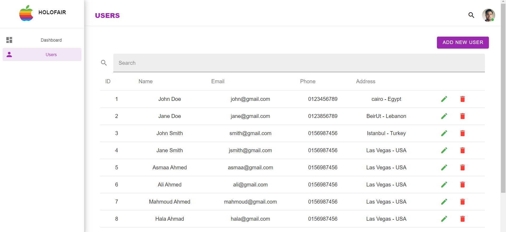
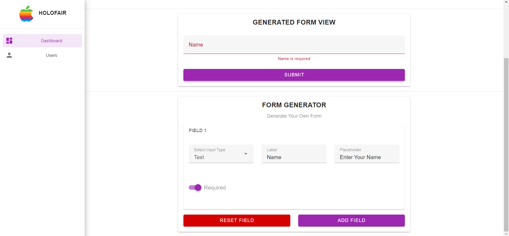

# admin-dashboard

> This is a simple admin dashboard template built with Vue.js and Vuetify and DataTables.
>> It contains a dynamic form GENERATOR
>> It contains a multi-step form

## Login Page


## Dashboard Cards


## Users Page


## Add New User Page


## Generate Form Page

<br />

<br />

<br />

## Multi-Step Form

<br />

<br />

<br />

<br /><br />

## Project setup
```
npm install
```

### Compiles and hot-reloads for development
```
npm run serve
```

### Compiles and minifies for production
```
npm run build
```

### Lints and fixes files
```
npm run lint
```
